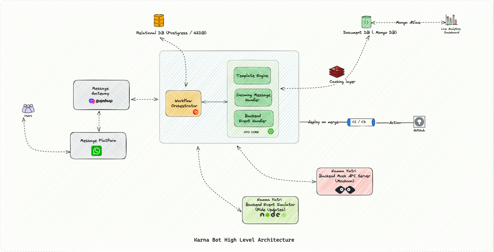

# Karna Bot

<!--  logo & tag goes here -->

> Smarter , Flexible, State-Aware Conversation Chat Bots for Your Quick Services

Karna is a Chatbot designed to facilitate ride booking on the Namma Yatri Ride Hailing Platform. The chatbot is
integrated with WhatsApp and provides multilingual support to users. Its primary goal is to deliver a seamless and
convenient booking experience, free of any complications. Additionally, Karna offers a range of other features to
enhance user experience.

## Features

> System Features

- **Multi-Platform Support**: The Karna Chat bot is designed to be integrated with multiple platforms, including WhatsApp, Telegram, Slack, and others. 

- **Parallel Conversation Support**: The bot is highly scalable and can handle a large number of conversations for multiple users parallel. 

- **Conversation Isolation** : The bot is designed to handle multiple conversations at the same time without interfering with other user conversations.

- **State-Aware Conversation**: The bot is designed to maintain the state of the conversation with the user. This means that the bot can remember information provided by the user earlier in the conversation and use it to provide more personalized responses. For example, if the user has already provided their location, the bot can use that information to suggest nearby ride options.

- **Integrated Template Engine**: The bot includes a template engine that allows the generation of messages and responses to user queries quickly and efficiently in multiple languages.

- **Horizontal Scalability**: The bot is designed to be horizontally scalable, meaning that it can handle a large number of users by distributing the workload across multiple servers.

- **Auto Conversation Closing**: The bot is designed to automatically close conversations with users after a specified period of inactivity.

> Bot Features

- **End-to-End Ride Booking** : Users can book a ride in Namma Yatri Platform from start to finish using the Karna Chat bot.

- **Ride Status Tracking** : The bot provides users with real-time updates on the status of their ride, such as driver
  ETA and more.

- **Ride Cancellation** : Users can cancel their booked ride using the bot.

- **Feedback Provision** : The bot allows users to provide feedback on their ride experience.

- **Multi-Language Support** : The bot supports multiple languages to cater to a wider user base, currently Kannada,
  Hindi and English are supported.

- **Starred Places Management** : Users can manage their frequently used or favorite locations and use them for booking
  rides quickly.

- **View Past Rides** : Users can view their ride history and check ride details.

- **Namma Yatri Open Data** : The bot provides access to Namma Yatri Open Data.

- **Additional Features** : The bot provides additional features such as support, FAQ section, and more.

## Tech Stack

- [Camunda](https://camunda.com/): A popular open-source platform for workflow automation and business process management.

- [Spring Boot](https://spring.io/projects/spring-boot): A popular framework for building REST APIs in Java.

- [Redis](https://redis.io/): is an in-memory data structure store that is often used as a database, cache, and message broker.

- [Mockoon](https://mockoon.com/): is an open-source tool that helps developers to simulate APIs. Mockoon was used to simulate Namma Yatri APIs.

- [MongoDB](https://www.mongodb.com/): is a popular NoSQL document database. We used MongoDB, to store our system's data and analytics details.

By using open-source technologies, we were able to build a scalable and robust ride-booking system that is both efficient and cost-effective.

## Bot In Action

Watch the video to get a better idea on how bot works

> Booking Ride on Namma Yatri Service

`Drop Video or video links here`

> Cancelling Ride on Namma Yatri Service

`Drop Video or video links here`

> Multi Lingual Support

`Drop Video or video links here`

> Managing Starred Places

`Drop Video or video links here`

## System Architecture Overview

The Karna Chat bot is a system composed of multiple components, each responsible for a specific function in the overall architecture. The following are the key system components: 

- **Message Platform** : This component acts as the primary interface between the user and the bot. Users can send messages or interact with the bot through various platforms such as WhatsApp, Slack, or Telegram.

- **Message Gateway** : This component receives messages from the message platform and forwards them to the bot engine. It is responsible for handling platform-specific logic and converting it to a generic format that can be understood by the bot engine. For the WhatsApp platform integration, we have used the gupshup.io platform.

- **Workflow Orchestrator** : This component manages the workflow of the bot and persists conversation state. It is responsible for deciding the next state of the conversation based on the user's input. We have used the Camunda BPMN engine for this component, which has its own relational database to store the state of the conversation.

- **Template Engine** : This component generates messages and responses to user queries quickly and efficiently in multiple languages.

- **Incoming Message Handler** : This component handles incoming messages from the Message Gateway.

- **Backend Event Handler** : This component handles backend events from the service provider platform, such as Namma Yatri, to receive users' ride updates.

- **Document DB** : his component maintains user configuration and template configuration and helps in the analytical dashboard.

- **Caching Layer** : This component caches user and template context to provide a faster response to the user.

- **Live Analytics Dashboard** : This component provides insights into the usage of the Karna Chat bot, such as the number of users, user trends, and active conversations. This information can be used to improve the bot's performance and user experience.

- **Namma Yatri Backend Mock Server** : his component is responsible for simulating the backend APIs of the service provider platform, Namma Yatri, and providing the simulated data to the bot. The mock server provides an interface that mimics the behavior of the actual backend APIs, allowing the bot to interact with it as if it were interacting with the real APIs

- **Backend Event Simulator Host** : This component is responsible for simulating the backend events from the service provider platform, such as Namma Yatri, and sending the simulated events to the bot. The simulator host provides an interface that mimics the behavior of the actual backend event streams, allowing the bot to receive the simulated events as if they were real. In this case we simulated ride updates event of Namma Yatri.

- **CI / CD Pipeline** : to deploy the code to the cloud and manage the deployment and versioning of the code.

## Low Level Design 

The low-level class diagram illustrates the implementation details of the Namma Yatri chatbot, including the classes and their relationships.

## Technical Documentation

TODO section

## Prerequisites to use Bot

To use Karna bot, you need to have an active WhatsApp account and a smartphone with a reliable
internet connection. Ensure that your WhatsApp account is registered with the phone number you wish to use to interact
with the Namma Yatri Service.

[//]: # (## Try It Out)

[//]: # (We are excited about the Karna Chat bot and can't wait for you to try it out. While we are not ready to make it public yet, we are building a waitlist for early access. Joining our waitlist will give you an exclusive opportunity to try out the Karna Chat bot. To join our waitlist, please register here [Link Goes Here])

## Open Analytics Dashboard
The analytics dashboard provides insights into the usage of the Karna Chat bot, such as the number of users, user trends, and active conversations. This information can be used to improve the bot's performance and user experience.

[Click here to view Live Analytics DashBoard ](https://charts.mongodb.com/charts-test-hwppi/public/dashboards/5f6a3bd3-8ed8-44e9-8480-f9915f290cc7)

[//]: # (![Screenshot 2023-04-23 at 10 12 49 PM]&#40;https://user-images.githubusercontent.com/21797317/233852809-a395d560-e6a5-4d26-99dc-d31dd7859cf7.png&#41;)

## Roadmap & Future Scope

- [X] Live Analytics Dashboard.
- [ ] Integrate with namma yatri SDK.
- [ ] View Conversation history of the user.
- [ ] Takeover the conversation from the bot and handle it manually if needed for support cases.
- [ ] Improve Live Analytics Dashboard.
- [ ] Build Adapter model to easily integrate with multiple Messaging Platforms.
- [ ] DashBoard to manage Template and Conversation flow.
- [ ] Campaign Management.
- [ ] Integrate with PostHog for product analytics, user analytics and more.

## How to set up

`docker-compose --env-file ~/.env.prod build`

## License

This project is licensed under the MIT License. You can find the license file in the root directory of this repository.

## Contribution

We welcome contributions to this project. If you find a bug or would like to suggest a new feature, please create a pull request or submit an issue. Before submitting your pull request, make sure to run the tests and ensure that they pass. We also ask that you follow our coding guidelines.

## Issues

If you encounter any issues while using this project, please create a new issue on our GitHub repository. We will do our best to address the issue as soon as possible. When creating an issue, please provide as much detail as possible, including steps to reproduce the issue and any error messages you received.

## Conclusion

In conclusion, the chatbot solution presented here provides an efficient and user-friendly way for interacting with various services. By leveraging popular messaging platforms like WhatsApp, the chatbot enables a seamless conversation-based experience for users to perform different actions without leaving the chat interface. The chatbot solution also includes various components such as a message platform, message gateway, workflow orchestrator, template engine, incoming message handler, backend event handler, conversation process orchestrator, document database, and more. These components work together to provide a robust and scalable architecture for handling large volumes of user interactions.

We welcome any feedback or suggestions you may have to help improve the chatbot solution further. With the ability to integrate with different messaging platforms and services, this solution can be adapted to various use cases and industries. As the chatbot ecosystem continues to grow, we believe that solutions like this will play an increasingly important role in providing seamless and efficient interactions between users and services.
